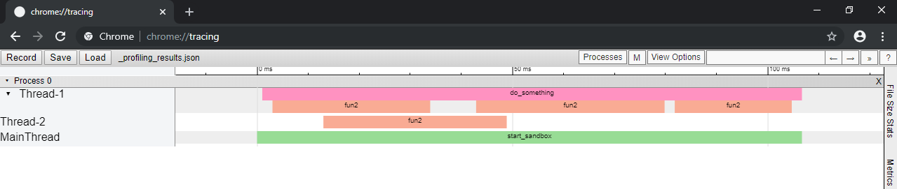

# pyprofiling


Profiling a program for visualization in chrome://tracing.

## Features


- Easy to use
- Only one line of code required
- Diagram is beautifully visualized in the chrome browser


## Show cases

Instead of starting your program like this:

```python
sandbox.main.start_sandbox()
```

You do:
 
```python
from pyprofiling import profile
profile(sandbox.main.start_sandbox, globals())
```

And get this:




## Installation


The easiest way to install is to use [pip](https://pip.pypa.io/en/stable/quickstart/):

```console
pip install pyprofiling
```

Or if you in a [Pipenv](https://pipenv.readthedocs.io/en/latest/):

```console
pipenv install pyprofiling
```


It is also possible to clone the repository from [Github](https://github.com/JulianSobott/pyprofiling):

```console
git clone https://github.com/JulianSobott/pyprofiling.git
```


## How to use

For setting up the profiler you only need to call the `profile()` method. 

```python
def profile(func: callable, globals_dict: dict, program_name: str = "", profile_name: str = "profiling_results", 
            *args, **kwargs):
    ...
```

**Necessary parameters:**

- `func`: In most cases the main function that starts your whole program. But this can also be
 functions that start a test or any other function.
- `globals_dict`: Just pass the globals with `globals()`. This is needed to setup the profiler for all functions in
 your script.

**Optional parameters:**

- `program_name`: This might be needed to ensure, that only functions from your program are profiled and not imported
 library functions. The name is your top-level folder name where all your files are in.
- `profile_name`: can be useful, when you want to profile different scenarios and want to keep all profiling results.
- `*args, **kwargs`: When your function `func` needs (named)-arguments you can pass them now.

### Short Example


```python
from pyprofiling import profile
profile(sandbox.main.start_sandbox, globals(), "sandbox", "startup")
```

When you now run the script, your program runs as it always does, only that at the end a new json file is created
 with all the profiling data. The path of the file is logged to the console at the end. 
Open now *chrome* and enter the url: `chrome://tracing/`. You should now see an almost empty page with only some
 buttons at the top. Navigate now in your file browser to the created file. Move it via drag and drop in the empty
  chrome window. When you drop it, it will be uploaded and processed and the data will be displayed.
  
On the left side you will every thread that you created. The main part is how long which function took and which
 functions it called inside. Note if a function is executed to fast it is almost impossible to see it.
  
### Navigating in the chrome tool

You can read more about the tool [here](https://www.chromium.org/developers/how-tos/trace-event-profiling-tool). But
 the important keyboard shortcuts are: 
 
- `a`: move timeline to the **left**
- `d`: move timeline to the **right**
- `w`: **zoom in** to cursor
- `s`: **zoom out** 

### Detailed Example

Consider the following project structure:

```
sandbox
|
--- src
    |   main.py
    |   helper.py
```

*main.py*

```python
import helper

def start(name):
    helper.do_something(name)
    helper.do_something_long()    
```

I would suggest to write all your profiling stuff in an separate script, to keep your original code clean. Because
 you don't want to run the profiler every time your program runs. So we create a new file in *sandbox/src/*:
 
*profiler.py*

```python
from pyprofiling import profile
import main

profile(main.start, globals(), "sandbox", "startup")
```


